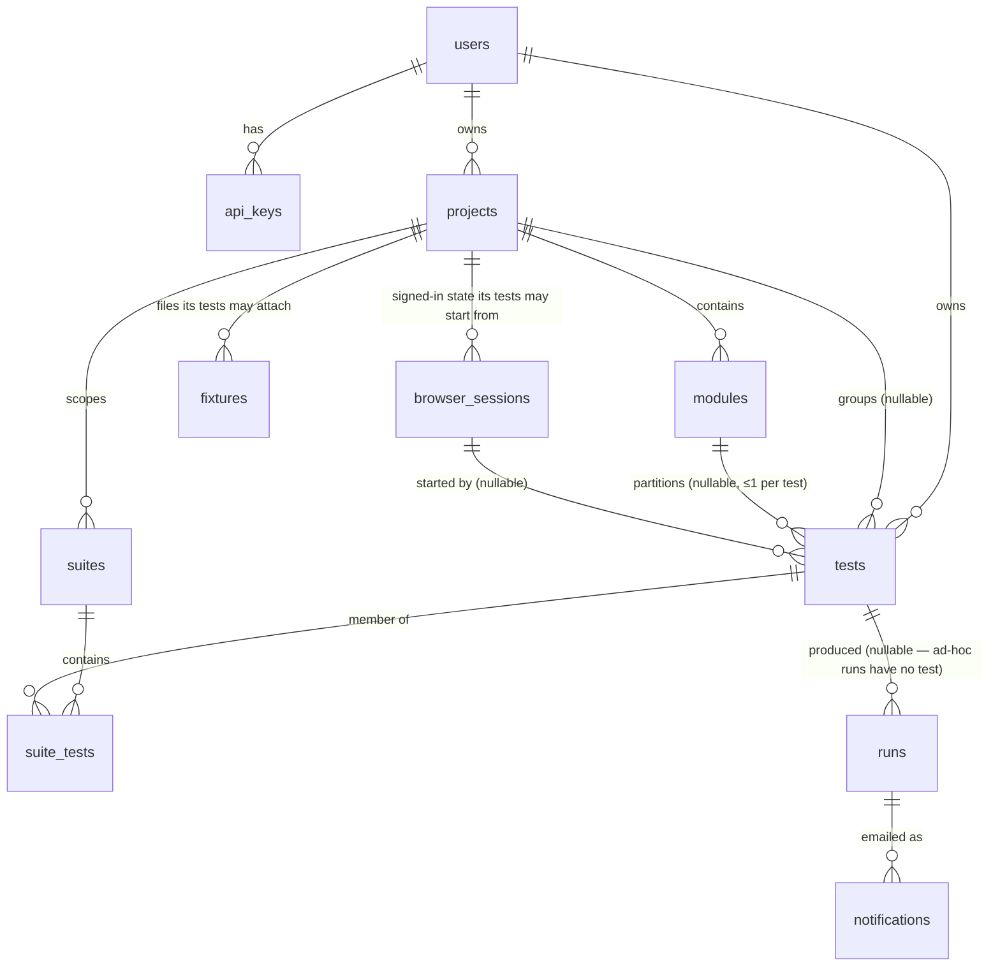

# Control-plane database design

Postgres schema for US-009–US-012 (+ stored BYOK keys from US-005). Migrations
live in [`migrations/`](migrations/), numbered SQL files applied in order —
`001_init.sql` is the whole initial design.

## Ground rules

- **Worker stays stateless** (README design principle). The DB is the control
  plane: tests, runs metadata, schedules, notification state. The live run
  relay (WebSocket frames/events) stays in memory as today.
- **Artifacts stay on disk**, under `runs/<id>/` exactly as now. The DB stores
  verdicts and status, never blobs. `runs.id` doubles as the directory name,
  so no path columns are needed.
- **A migration that has been applied anywhere is never edited.** Fix it
  forward with the next number. `schema_migrations` records a filename, so an
  edited file does not re-run: the change then exists only in the repo, and
  every database that already ran it stays silently on the old shape while every
  fresh install is correct. That divergence is invisible to the test suite,
  which always builds from zero — it surfaces as a 500 on one box and nowhere
  else. `016` exists because this was learned the expensive way on a
  one-day-old, uncommitted `015`; "it can't have run anywhere yet" is not a
  question the file can answer about itself.
- **Column names mirror `server.js`** (`goal`, `start_url`, `max_steps`,
  `status` values `queued/running/passed/failed/completed/error/cancelled`
  (the last added by `011`, US-047 — a stop is terminal but is not a failure),
  `report_status`) so persisting a run is a straight insert of the existing
  in-memory object.

## Entities

| Table | Owns | Story |
|---|---|---|
| `users` | identity + encrypted OpenAI key (BYOK) | US-005/009 |
| `api_keys` | hashed bearer tokens, revocable — replaces the single `WORKER_API_TOKEN` | US-009 |
| `tests` | saved goal+URL+settings, per-test schedule | US-009/010 |
| `projects` | top-level container: name + slug, and the notify prefs for everything inside it | US-023/012 |
| `modules` | grouping inside a project; a test belongs to at most one | US-023 |
| `suites` + `suite_tests` | named test groups for one-shot triggering (US-008 CI), scoped to a project | US-009/023 |
| `runs` | durable run history — replaces the in-memory Map for finished runs | US-009/011 |
| `fixtures` | metadata for the files a project's tests may attach — never the bytes | US-048 |
| `browser_sessions` | a project's saved, signed-in browser state, encrypted; never read back | US-043 |
| `notifications` | per-recipient email delivery log (idempotent sends) | US-012 |
| `email_suppressions` | addresses that unsubscribed, instance-wide | US-012 |
| `subscriptions` | one row per paying user: Stripe ids, status, period end, scheduled cancellation | US-022/051 |
| `stripe_events` | idempotency ledger — a conflicting insert means "already applied" | US-022 |

The diagram above is the deployed schema through `002_projects_modules.sql`.

`browser_sessions.storage_state_ciphertext` is the only credential in this
schema besides `users.openai_key_ciphertext`, and it is held in the same
envelope for the same reason — a value we must be able to hand to a spawn, so it
cannot be a one-way hash. It differs from every other column here in one
respect worth stating: **no read path selects it.** The counts and `captured_at`
beside it exist so that a session can be described without being readable, which
is the only way a user can tell a live session from a stale one. Everything
about how the decrypted blob reaches a browser, and what removes it afterwards,
is `server/src/browserSession.js` and its row in
`backlog/correctness-critical.md`.

Both billing tables are inert unless the instance is configured for billing
(`STRIPE_*`, which no self-host sets): nothing writes to them and nothing reads
them, so a free deployment carries two empty tables and no behaviour. A
subscription is one row rather than columns on `users` because Stripe's ids and
status are a single lifecycle that a webhook rewrites as a unit, and `status`
deliberately carries no check constraint — the value is whatever Stripe sends,
and which of them may run is one function in `server/src/billing.js`.

Both date columns are Stripe's, and neither is where the API originally put it
(US-051): `current_period_end` lives on the subscription *item* since API
version `2025-03-31.basil`, and a scheduled cancellation is the `cancel_at`
timestamp rather than the `cancel_at_period_end` boolean — observed False on a
genuinely scheduled cancellation. Only `current_period_end` feeds the
entitlement gate; `cancel_at` exists so Settings can say when access ends.

## Key decisions

- **Runs denormalize `goal`/`start_url`/`max_steps`/`model`** at enqueue time.
  Editing or deleting a test must not rewrite history; `test_id` is
  `on delete set null` so ad-hoc and orphaned runs are the same shape.
- **No `suite_runs` table.** Running a suite creates one `runs` row per member
  test and returns the ids; US-008 CI polls each run. A grouping row buys
  nothing until something needs a suite-level verdict — add it then. Module
  and project runs (US-023) work the same way.
- **Module vs suite is the cardinality.** A test has at most one `module_id`
  (a partition), but any number of suite memberships (an arbitrary selection).
  Both are runnable; that is why both exist.
- **Grouping is optional, and never invented.** `tests.project_id` /
  `module_id` are nullable, both `on delete set null`, so deleting a project or
  module never deletes tests — they fall back to Ungrouped. No "Default
  project" is created for anyone except users who already owned suites when
  `002` backfilled `suites.project_id` (which is NOT NULL: a suite's membership
  is confined to its project, so it needs one).
- **`runs` is not project-aware.** It already denormalizes goal/start_url at
  enqueue time, and history must stay accurate after a test is re-filed;
  filtering run history by project/module joins through `tests` (best-effort,
  since `runs.test_id` is `on delete set null`).
- **Slugs on `projects` and `modules`** so CI configs hold
  `/api/projects/checkout/modules/auth/run` rather than a UUID. Unique per
  parent, generated once at create time, and *not* re-derived on rename — a
  rename silently breaking a CI config is the worse failure.
- **Schedule is columns on `tests`, not a table.** US-010 is one schedule per
  test; a join table adds nothing. `next_run_at` is precomputed so the
  scheduler is a cheap poll (`tests_due_idx` is a partial index over enabled
  schedules only), and it survives restarts. Overlap-skip = "does this test
  have a row in `runs` with status queued/running" (`runs_active_idx`).
- **Notification prefs on `projects`, not `tests`** (`notify` mode +
  `notify_emails[]`). 001 put them on `tests`, written before projects existed
  and never read; `004_notifications.sql` drops them and adds them a level up.
  A recipient list is something a person owns — "mail the checkout team when
  checkout breaks" — and per-test means editing twenty rows to add one
  colleague. `notify` is not-null-with-a-default rather than nullable-means-
  inherit, because two kinds of "unset" would resolve to the same env value
  anyway. Delivery attempts land in `notifications` with a `(run_id,
  recipient)` unique key, so a crashed or retried sender can't double-email;
  the claim is `insert … select … where not exists … returning` rather than
  `on conflict … returning`, which pg-mem answers with the conflicting row as
  though it had inserted it. Unsubscribes are addresses in
  `email_suppressions`, checked on every send — by address rather than by
  project, so joining a second project can't silently re-subscribe anyone.
- **Step-level detail is not in the DB.** It already lives in
  `report_data.json` on disk and is only read to render the report. If a
  per-step UI is ever needed, add a `steps jsonb` column then — don't pay for
  it now.
- **BYOK stored keys**: `users.openai_key_ciphertext` is app-side encrypted
  (AES-256-GCM with a server secret from env), nullable — per-request keys
  (US-005 v1) keep working and nothing is persisted unless the user opts in.
- **`users.max_concurrent_runs` is an exception, not a setting** (US-058).
  Nullable with no default, because a default here would be a second home for
  `MAX_CONCURRENT_PER_USER` and the resolution order has exactly one. `> 0` is
  enforced by a *named* check constraint: zero would be an account suspension
  rather than a capacity limit, and naming it means a later `drop constraint`
  can't silently no-op on one engine (US-047's lesson). Note that **pg-mem can
  neither parse the inline-check form nor enforce the named one**, so that
  constraint is only ever provable against a real server.
- **Retention (US-011, shipped)**: rows are kept forever, artifacts are not.
  After `ARTIFACT_RETENTION_DAYS` (default 7) the sweep stamps
  `artifacts_deleted_at` and *then* removes `runs/<id>/` — that order means a
  crash between the two leaves a stale directory the next sweep collects,
  rather than a row advertising a report that no longer exists. History stays
  browsable with its verdict; only the links go dead.
  **Row-level retention is deferred, not rejected**: rows are cheap next to
  artifacts and a pass/fail timeline is worth more the older it gets, so
  nothing deletes them today. Revisit when scheduled runs (US-010) or scaling
  (US-015) push volume up — `final_result` is a paragraph per run, and
  `GET /api/runs` computes an exact `count(*)` — or when the hosted tier makes
  deletion a compliance requirement rather than a housekeeping choice.
- **Crash recovery**: on boot, any row still `queued`/`running` is stale (the
  worker died with it) — mark it `error`. The partial index makes this free.

## Implementation notes (for US-009)

- Driver: plain `pg` + these SQL files run in order at startup (tracked in a
  tiny `schema_migrations` table). No ORM — the server is small, hand-written
  SQL keeps it that way. Revisit only if query count balloons.
- `docker-compose.yml` gains a `postgres:16` service + volume; server gets
  `DATABASE_URL`. Local dev without Docker: any local Postgres works.
- v1 seeds one user (operator email) and one api_key hashed from
  `WORKER_API_TOKEN`, so existing clients/CI keep working unchanged.
