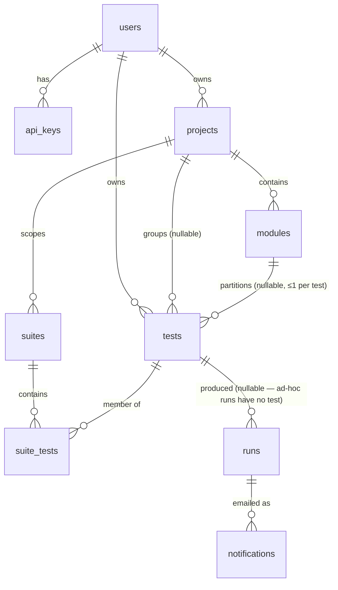

# Control-plane database design

Postgres schema for US-009–US-012 (+ stored BYOK keys from US-005). Migrations
live in [`migrations/`](migrations/), numbered SQL files applied in order —
`001_init.sql` is the whole initial design.

## Ground rules

- **Worker stays stateless** (README design principle). The DB is the control
  plane: tests, runs metadata, schedules, notification state. The live run
  relay (WebSocket frames/events) stays in memory as today.
- **Artifacts stay on disk**, under `runs/<id>/` exactly as now. The DB stores
  verdicts and status, never blobs. `runs.id` doubles as the directory name,
  so no path columns are needed.
- **Column names mirror `server.js`** (`goal`, `start_url`, `max_steps`,
  `status` values `queued/running/passed/failed/completed/error`,
  `report_status`) so persisting a run is a straight insert of the existing
  in-memory object.

## Entities

| Table | Owns | Story |
|---|---|---|
| `users` | identity + encrypted OpenAI key (BYOK) | US-005/009 |
| `api_keys` | hashed bearer tokens, revocable — replaces the single `WORKER_API_TOKEN` | US-009 |
| `tests` | saved goal+URL+settings, per-test schedule, per-test notify prefs | US-009/010/012 |
| `projects` | top-level container: name + slug | US-023 |
| `modules` | grouping inside a project; a test belongs to at most one | US-023 |
| `suites` + `suite_tests` | named test groups for one-shot triggering (US-008 CI), scoped to a project | US-009/023 |
| `runs` | durable run history — replaces the in-memory Map for finished runs | US-009/011 |
| `notifications` | per-recipient email delivery log (idempotent sends) | US-012 |

The diagram above is the deployed schema through `002_projects_modules.sql`.

## Key decisions

- **Runs denormalize `goal`/`start_url`/`max_steps`/`model`** at enqueue time.
  Editing or deleting a test must not rewrite history; `test_id` is
  `on delete set null` so ad-hoc and orphaned runs are the same shape.
- **No `suite_runs` table.** Running a suite creates one `runs` row per member
  test and returns the ids; US-008 CI polls each run. A grouping row buys
  nothing until something needs a suite-level verdict — add it then. Module
  and project runs (US-023) work the same way.
- **Module vs suite is the cardinality.** A test has at most one `module_id`
  (a partition), but any number of suite memberships (an arbitrary selection).
  Both are runnable; that is why both exist.
- **Grouping is optional, and never invented.** `tests.project_id` /
  `module_id` are nullable, both `on delete set null`, so deleting a project or
  module never deletes tests — they fall back to Ungrouped. No "Default
  project" is created for anyone except users who already owned suites when
  `002` backfilled `suites.project_id` (which is NOT NULL: a suite's membership
  is confined to its project, so it needs one).
- **`runs` is not project-aware.** It already denormalizes goal/start_url at
  enqueue time, and history must stay accurate after a test is re-filed;
  filtering run history by project/module joins through `tests` (best-effort,
  since `runs.test_id` is `on delete set null`).
- **Slugs on `projects` and `modules`** so CI configs hold
  `/api/projects/checkout/modules/auth/run` rather than a UUID. Unique per
  parent, generated once at create time, and *not* re-derived on rename — a
  rename silently breaking a CI config is the worse failure.
- **Schedule is columns on `tests`, not a table.** US-010 is one schedule per
  test; a join table adds nothing. `next_run_at` is precomputed so the
  scheduler is a cheap poll (`tests_due_idx` is a partial index over enabled
  schedules only), and it survives restarts. Overlap-skip = "does this test
  have a row in `runs` with status queued/running" (`runs_active_idx`).
- **Notification prefs on `tests`** (`notify` mode + `notify_emails[]`),
  delivery attempts in `notifications` with a `(run_id, recipient)` unique
  key — a crashed/retried sender can't double-email.
- **Step-level detail is not in the DB.** It already lives in
  `report_data.json` on disk and is only read to render the report. If a
  per-step UI is ever needed, add a `steps jsonb` column then — don't pay for
  it now.
- **BYOK stored keys**: `users.openai_key_ciphertext` is app-side encrypted
  (AES-256-GCM with a server secret from env), nullable — per-request keys
  (US-005 v1) keep working and nothing is persisted unless the user opts in.
- **Retention (US-011, shipped)**: rows are kept forever, artifacts are not.
  After `ARTIFACT_RETENTION_DAYS` (default 7) the sweep stamps
  `artifacts_deleted_at` and *then* removes `runs/<id>/` — that order means a
  crash between the two leaves a stale directory the next sweep collects,
  rather than a row advertising a report that no longer exists. History stays
  browsable with its verdict; only the links go dead.
  **Row-level retention is deferred, not rejected**: rows are cheap next to
  artifacts and a pass/fail timeline is worth more the older it gets, so
  nothing deletes them today. Revisit when scheduled runs (US-010) or scaling
  (US-015) push volume up — `final_result` is a paragraph per run, and
  `GET /api/runs` computes an exact `count(*)` — or when the hosted tier makes
  deletion a compliance requirement rather than a housekeeping choice.
- **Crash recovery**: on boot, any row still `queued`/`running` is stale (the
  worker died with it) — mark it `error`. The partial index makes this free.

## Implementation notes (for US-009)

- Driver: plain `pg` + these SQL files run in order at startup (tracked in a
  tiny `schema_migrations` table). No ORM — the server is small, hand-written
  SQL keeps it that way. Revisit only if query count balloons.
- `docker-compose.yml` gains a `postgres:16` service + volume; server gets
  `DATABASE_URL`. Local dev without Docker: any local Postgres works.
- v1 seeds one user (operator email) and one api_key hashed from
  `WORKER_API_TOKEN`, so existing clients/CI keep working unchanged.
