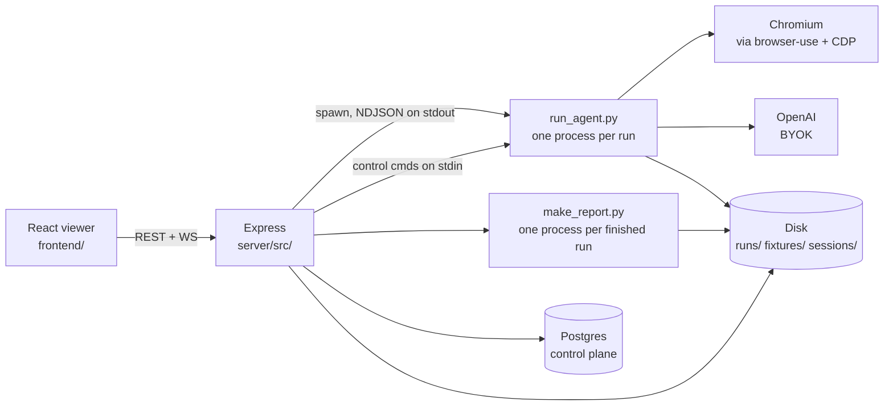

# QAssist architecture

How the whole thing is put together, in one file: the processes, the code map,
the protocols between the parts, and the rules that decide where a new piece
goes.

It is the *shape* and the *reasons*. It deliberately does not restate what
another file owns — the HTTP surface is [`api.md`](api.md), the schema is
[`db/README.md`](../db/README.md), the boxes and hostnames are
[`DEPLOY.md`](../DEPLOY.md), and what a user *does* with any of it is the
[manual](../manual/). Each section links to the code it describes; the code is
the source of truth when the two disagree.

---

## 1. The shape

A user gives a URL and a plain-English goal. An LLM agent drives a real
Chromium browser toward that goal, streams what it sees, decides pass or fail,
and leaves evidence behind.



Four facts about that picture carry most of the design:

1. **The worker is stateless.** Express holds live runs in memory and nothing
   else. Every durable fact is in Postgres; every large artifact is on disk. A
   restart loses the queue and the live relay, and no more.
2. **One process per run.** The agent is spawned, not embedded. It gets its own
   process group, so a watchdog can kill an entire misbehaving browser tree
   without touching the server.
3. **The pipe is the interface.** Server → agent is environment variables plus
   a line-oriented stdin channel. Agent → server is newline-delimited JSON on
   stdout. Nothing else crosses that boundary.
4. **The run engine is synchronous.** `createRun` and `startRun` do not await.
   Anything a run needs from the database — the BYOK key, a session blob,
   stored secrets — is resolved *before* the engine is entered, by the route or
   by the scheduler.

---

## 2. Processes

| Process | Started by | Lifetime | Holds state? |
|---|---|---|---|
| Express server | `node server/src/server.js` (image `CMD`) | The container | Live runs, WS subscribers, the queue, the per-user cap cache |
| `agent/run_agent.py` | `spawn` in [`runs.js`](../server/src/runs.js) | One run | No — everything it learns it emits |
| Chromium | browser-use, inside the agent | One run | No |
| `agent/make_report.py` | `spawn` when a run reaches a terminal status | One render | No |
| Postgres | compose service `db` | The stack | Everything durable |
| Vite dev server | `cd frontend && npm run dev` | Development only | No |
| nginx + a builder | `docker-compose.docs.yml` | The docs site | No — it follows `manual/` on `dev` |

The app image is a **single container**: Node is the primary runtime, Python
and Chromium ride along ([`Dockerfile`](../Dockerfile)). There is no separate
worker service, no queue broker, and no sidecar. Scaling past one box is
[US-015](../backlog/unscheduled/US-015-horizontal-scaling-100-concurrent.md)
and is not built.

Three timers run inside the Express process, all `unref`'d so none of them can
hold the process open: the scheduler tick (60 s), the retention sweep (6 h),
and — on a demo deployment only — the tenant reaper.

---

## 3. Code map

### 3.1 Top level

| Directory | What lives there |
|---|---|
| `agent/` | The Python agent and the PDF renderer. No HTTP, no database. |
| `server/src/` | Express: the run engine, the control-plane access, the gates. |
| `server/src/routes/` | The HTTP surface only. Engines live one level up. |
| `frontend/src/` | React + Vite viewer. |
| `db/migrations/` | Numbered SQL. The schema's source of truth. |
| `extension/` | Chrome MV3 extension for capturing a signed-in session. |
| `manual/` | VitePress user manual, published to `docs.qassist.run` off `main`. |
| `docs/` | Contributor material — this file, `api.md`, `testing.md`, deploy runbooks. |
| `backlog/` | One file per user story, by sprint folder. Results live in the story. |
| `demo/` | Checked-in replay fixtures for the demo sandbox. |
| `scripts/` | Repo checks: doc links, design tokens, extension packaging. |

### 3.2 Server modules

Engines (`server/src/`):

| Module | Owns |
|---|---|
| [`server.js`](../server/src/server.js) | Wiring: the auth gate, router mounts, the WS upgrade, boot refusals. ~300 lines and meant to stay there. |
| [`runs.js`](../server/src/runs.js) | The run engine's entry: admission, the queue, one agent process (spawn, watchdogs, NDJSON loop, stop). Re-exports the surface the routes import. |
| [`runState.js`](../server/src/runState.js) | The in-memory registry, the `Run` typedef every reader resolves through, and the derived views — `verdictOf`, `stepsOf`, `diagnosticsOf`. Talks to nothing. |
| [`runEvents.js`](../server/src/runEvents.js) | The NDJSON protocol, one typedef per event. Types only — no runtime, and the sole written copy of the shapes (§4.3). |
| [`runRelay.js`](../server/src/runRelay.js) | What WS subscribers are sent, what a late viewer replays, the screencast toggle. |
| [`runPersistence.js`](../server/src/runPersistence.js) | The runs row, a login run's captured session, the one mail per finished run — ordered on `run.persisted`. |
| [`runReport.js`](../server/src/runReport.js) | `report_data.json` and the PDF render. |
| [`runReplay.js`](../server/src/runReplay.js) | Demo replay: a fixture driven over the same relay a real run uses. |
| [`config.js`](../server/src/config.js) | Every environment variable, read once at import. |
| [`db.js`](../server/src/db.js) | Pool, migrations, operator seed, crash recovery, the per-request user scope. |
| [`auth.js`](../server/src/auth.js) | Session cookies, login links, per-user API keys; `authEnabled()` / `demoMode()`. |
| [`boot.js`](../server/src/boot.js) | The pure predicate for "may this process serve?". |
| [`concurrency.js`](../server/src/concurrency.js) | The one resolution order for a user's concurrent-run cap. |
| [`scheduler.js`](../server/src/scheduler.js) | The minute tick: claim a due schedule, resolve its target, enqueue. |
| [`schedule.js`](../server/src/schedule.js) | Slot math — validate a preset, answer "when next?". |
| [`slotVerdict.js`](../server/src/slotVerdict.js) | One schedule firing collapsed to one mark for the health strip. |
| [`retention.js`](../server/src/retention.js) | The artifact sweep. |
| [`navigationPolicy.js`](../server/src/navigationPolicy.js) | Where a run's browser may go. Pure. |
| [`browserSession.js`](../server/src/browserSession.js) | Saved signed-in state: encrypt, hand to a spawn, capture back, sweep. |
| [`sessionCapture.js`](../server/src/sessionCapture.js) | The one-shot token the browser extension posts with. |
| [`testSecrets.js`](../server/src/testSecrets.js) | The value behind a test's `secret` variable. Write-only. |
| [`variables.js`](../server/src/variables.js) | Per-run variable declaration, override and substitution. |
| [`fixtures.js`](../server/src/fixtures.js) | The files a project's tests may attach; the boot path check. |
| [`openaiKey.js`](../server/src/openaiKey.js) | The stored BYOK key and the per-run resolution order. |
| [`crypto.js`](../server/src/crypto.js) | AES-256-GCM envelope for everything stored reversibly. |
| [`billing.js`](../server/src/billing.js) | Stripe: enablement, the entitlement question, the webhook. |
| [`activation.js`](../server/src/activation.js) | The post-subscribe capacity window. |
| [`mail.js`](../server/src/mail.js) | The transport. One POST to Resend. |
| [`notify.js`](../server/src/notify.js) | Who hears about a finished run, and whether. |
| [`mailTemplate.js`](../server/src/mailTemplate.js) | The single layout every send site fills in. |
| [`demo.js`](../server/src/demo.js) / [`demoTenant.js`](../server/src/demoTenant.js) / [`demoSeed.js`](../server/src/demoSeed.js) / [`demoReaper.js`](../server/src/demoReaper.js) | The sandbox: fixtures, per-visitor tenants, the dataset they are seeded with, expiry. |
| [`procMemory.js`](../server/src/procMemory.js) | PSS over a run's process tree. |

Routes (`server/src/routes/`) are the HTTP surface and nothing else:
`runs`, `tests`, `suites`, `projects` (which also holds the module query
helpers), `modules`, `schedules`, `sessions`, `fixtures`, `notifications`,
`auth`, `keys`, `account`, `billing`, `capture`, `demoSession`, plus
[`helpers.js`](../server/src/routes/helpers.js) — the shared column fragments
and the run-start middleware. Endpoint-by-endpoint documentation is
[`api.md`](api.md).

### 3.3 Agent modules

| Module | Owns |
|---|---|
| [`run_agent.py`](../agent/run_agent.py) | One run: browser-use `Agent`, the screencast, the CDP hookup, the callbacks' wiring, the terminal event. Everything left in it needs a browser (US-074). |
| [`step_events.py`](../agent/step_events.py) | The `step` event and the durable screenshot, and the order a step boundary does them in. |
| [`session_recorder.py`](../agent/session_recorder.py) | Which screencast frames reach the encoder, and the recording's lifecycle around it. |
| [`make_report.py`](../agent/make_report.py) | `report_data.json` → HTML → PDF, rendered by the same Chromium. |
| [`report_format.py`](../agent/report_format.py) | Pure formatters for that HTML. |
| [`diagnostics.py`](../agent/diagnostics.py) | Failed requests, console errors and exceptions — capped, deduplicated, scrubbed. |
| [`redact.py`](../agent/redact.py) | `scrub()`: removes secret values from anything about to be emitted. |
| [`navigation_policy.py`](../agent/navigation_policy.py) | The fence, as browser-use profile kwargs; recognizing a block in an error string. |
| [`browser_session.py`](../agent/browser_session.py) | Start authenticated, run a preamble, detect expiry, export what was captured. |
| [`secret_vars.py`](../agent/secret_vars.py) | `QA_VARS` → browser-use `sensitive_data`. |
| [`fixtures.py`](../agent/fixtures.py) | `QA_FIXTURES` → `available_file_paths`. |
| [`email_codes.py`](../agent/email_codes.py) | IMAP mailbox for registration flows. |
| [`exit_watchdog.py`](../agent/exit_watchdog.py) | Bounds teardown once the verdict is out. |
| [`measure_memory.py`](../agent/measure_memory.py) | The committed instrument behind `MAX_RUN_MEMORY_MB`. |

---

## 4. The spine: one run, end to end

### 4.1 From request to spawn

1. **The gate** (`makeGate` in [`server.js`](../server/src/server.js)) resolves
   the caller to a user id and opens an `AsyncLocalStorage` store for the rest
   of the request. Every user-scoped query reads `currentUserId()` rather than
   threading an id through signatures, so a handler cannot silently forget to
   scope.
2. **The run-start middleware chain**, in this order and for stated reasons
   ([`helpers.js`](../server/src/routes/helpers.js)):
   `requireEntitled` → `requireAgentKey` → `withUserCap`.
   Entitlement answers first, so a caller who has not paid hears "pay" rather
   than "configure a key" they would still be refused for. Activation is fused
   into the entitlement middleware so no start path can have one check without
   the other.
3. **Pre-resolution.** The route decrypts the BYOK key, the saved session and
   the stored secrets *before* calling the engine — the engine is synchronous.
4. **`createRun`** ([`runs.js`](../server/src/runs.js)) is the sole funnel for
   every trigger: ad-hoc, saved test, suite, module, project, schedule, retry.
   It applies, in order:
   - the **navigation fence** on `start_url` — refused first, so a caller aimed
     at a metadata endpoint hears that rather than a cap message, and a refused
     run costs no row, no slot and no LLM call;
   - **admission** against the caller's per-user cap — an interactive submit
     over the cap is refused, not queued, because a silent queue makes the wait
     unbounded and a queue position meaningless. Schedules and demo replays
     bypass admission;
   - the row insert, then one of three paths: **replay** (demo mode),
     **start now** (a global slot is free and the owner is under their cap), or
     **queue** with a position broadcast.
5. **`startRun`** builds the child environment, writes the session blob to a
   per-run directory if there is one, and spawns the agent `detached` so it
   leads its own process group.

Batch triggering (`runTests`) starts one run per member test and reports each
member's outcome separately. A member that cannot resolve a variable, cannot
decrypt a session, is fenced, or is over the cap is marked and skipped — one
misconfigured test never costs the batch its other results.

### 4.2 Server → agent: the environment contract

Set in `startRun`, and the only way in:

| Variable | Carries |
|---|---|
| `QA_GOAL`, `QA_START_URL`, `QA_MAX_STEPS` | The task |
| `QA_RUN_ID`, `ARTIFACTS_DIR` | Where artifacts go |
| `QA_VARS` | Real secret values → browser-use `sensitive_data` |
| `QA_FIXTURES` | Absolute paths this run may read or upload. Always sent, even empty — absent and `[]` must be distinguishable |
| `QA_STORAGE_STATE` | **Path** to the decrypted session. Never the blob, never a dict — browser-use silently loads nothing from a dict |
| `QA_STORAGE_STATE_OUT`, `QA_SESSION_VERIFY`, `QA_INITIAL_ACTIONS` | Capture target, expiry check, deterministic preamble |
| `QA_HAR` | `1`/`0`, always sent, so an unset value cannot inherit the server's |
| `OPENAI_API_KEY` | The run's key — **deleted** rather than left unset when there is none, so a run can never fall through to the operator's key |
| `BROWSER_USE_MODEL` | Model id |
| Fence variables | From `agentEnvFor(policy)`; always sent, because browser-use's own default for private-address blocking is off |

### 4.3 Agent → server: NDJSON on stdout

One JSON object per line, flushed immediately. **The shapes are
[`server/src/runEvents.js`](../server/src/runEvents.js)** — one typedef per
event, and the only written copy, so `npm run check` fails when the relay or a
route reads a field the agent no longer writes (US-073). The table below is
what each event is *for*; the fields are there.

| Event | Meaning | Durable? |
|---|---|---|
| `start` | Goal, URL, model | yes |
| `frame` | Base64 JPEG screencast, ~6 fps, only while a viewer is attached | **no** — only the latest is kept |
| `step` | One agent reasoning step: evaluation, next goal, URL, screenshot file | yes |
| `progress` | Free-text live note (e.g. waiting for a confirmation email) | yes, but carries no step number, so it never reaches the report |
| `diagnostics` | A batch of failed requests / console errors / exceptions, stamped with their step | yes |
| `blocked` | The navigation fence refused a URL | yes |
| `preamble` | The deterministic actions that ran before step 1 | yes |
| `recording` | The mp4 is finalized. Always precedes `done`/`error` so the report can link it | yes |
| `done` | Terminal: verdict, steps, duration, final result, errors | yes |
| `error` | Terminal: the run crashed | yes |

Two rules hold this together. **The pipe must never back up** — diagnostics are
batched per step, never per console line, and frames are capped and downscaled.
**Everything emitted is scrubbed** — `scrub()` runs against the same live
`sensitive` dict browser-use holds, so a code fetched mid-run is redacted from
events emitted after it arrives.

### 4.4 Server → agent: the control channel

Line-delimited JSON on the child's stdin:

- `{"cmd":"screencast","on":true|false}` — a viewer attached, or the last one
  left. An unwatched run skips JPEG encoding entirely, which is why a
  CI-triggered run costs less than a watched one.
- `{"cmd":"stop"}` — the user stopped this run. browser-use checks its stop flag
  before every action, so this normally lands within one in-flight action and
  `agent.run()` still returns its history. That is the point: `SIGKILL` leaves
  an mp4 with no moov atom — unplayable, at exactly the moment someone wanted
  to look at it. A grace timer is the backstop, never the first move.
- `{"cmd":"pause"}` / `{"cmd":"resume"}` (US-079) — the same checkpoint the stop
  flag is read at, so a pause lands within roughly one in-flight action.
- `{"cmd":"hint","text":…}` — a person's mid-run correction, appended to the
  agent's history as a follow-up request. Additive: the goal survives and the
  run continues from the step it was on. A hint also releases a paused run.

**Pausing moves two timers, and that pair is correctness-critical.** The pause
suspends the wall-clock watchdog — a paused run is doing what it was told and
must not be reported as a resource failure — and starts a `PAUSE_MAX_SECONDS`
budget of its own, because a suspended ceiling and nothing else would leak a
browser, a process and a concurrency slot. The budget escalates through
`stopRun`, so a forgotten pause ends `cancelled` with its evidence. A resume
re-arms the wall clock with the **remainder**, never a fresh ceiling, or the
limit would be defeatable by pausing repeatedly. Spec:
[`pause-run.test.js`](../server/test/pause-run.test.js).

### 4.5 Server → browser: the WebSocket

`ws://<host>/ws?runId=…`, authenticated on the upgrade. A run the caller does
not own is reported as **absent, not forbidden**.

`attachViewer` replays the durable event buffer, then sends the live-only state
(current queue position, latest frame), then live updates follow. The split
matters: queue position and frames are live-only precisely because replaying
them would make a late viewer watch a countdown that already finished.

### 4.6 Finishing

The `close` handler is the one funnel every ending passes through — a clean
exit, either watchdog's kill, a stop, and a spawn that failed outright. It
frees the slot, removes the session files, clears timers, resolves the final
status, persists, broadcasts `end`, notifies, and drains the queue.

The **verdict is the server's, not the agent's**. `verdictOf()` returns `null`
for a cancelled run even though browser-use returns a self-report out of
`Agent.stop()` — honouring that report would turn a run somebody aborted into
a green build.

`generateReport` always writes `report_data.json` (the step list and the
diagnostics endpoint read it) and spawns the PDF renderer only when
`REPORTS_ENABLED`. Mail waits for both the run and the report to settle;
whichever finishes the pair triggers the send, and the `(run_id, recipient)`
unique key makes a double-send impossible.

---

## 5. Concurrency, queueing, scheduling

**Two caps.** `MAX_CONCURRENT_SESSIONS` is the machine's — it exists because a
run peaks around 700 MB. `MAX_CONCURRENT_PER_USER` (with an optional per-user
override) is the fair-use one; unset, the engine takes a byte-for-byte
pre-cap FIFO branch rather than a path that merely happens to come out the same.

**The cap is resolved in one place** ([`concurrency.js`](../server/src/concurrency.js)):
override → instance default → uncapped. It is a cache of exceptions, not a copy
of the users table, and it is read synchronously because the three gates that
ask (admission, `canStart`, the drain scan) cannot await. Stamping a cap onto a
run at admission was rejected: a queued run would then keep the generous cap it
was admitted under, so lowering an account's cap would not reach the burst that
prompted it.

**The queue is in memory and not durable.** A restart marks everything still
waiting as `error` — `recoverStaleRuns` in [`db.js`](../server/src/db.js) does
this at boot, because the worker holds no cross-restart state and nothing could
ever finish those rows.

**Draining is fair-share when anything is capped**: promote the first queued run
whose owner is under their running cap, not simply the head. A slot may be left
idle when every waiter is already at their cap. It is a linear scan over a small
queue, deliberately not a scheduler.

**The scheduler** ([`scheduler.js`](../server/src/scheduler.js)) ticks once a
minute and is stateless between ticks — the first tick after boot *is* the
catch-up. Per due schedule:

1. **Claim before firing**, by advancing `next_run_at` in one guarded statement.
   A crash between claim and fire skips one slot; the other order would re-fire
   every boot, and a run costs real tokens. The guard is "still due" rather than
   "unchanged", because a timestamp round-trip loses microseconds and equality
   would make the row unclaimable forever.
2. **Gates after the claim** — billing, activation, and the owner's stored key.
   The slot is consumed either way, so a lapsed month accumulates no backlog
   that all fires at once when it resolves.
3. **Resolve the target** (test, module, project or suite) with the same
   function the save-time route uses, so the two cannot disagree about what a
   schedule would do.
4. **Overlap-skip per member**: a test still queued or running is dropped from
   this slot, but only that test.
5. **Enqueue** through the same `runTests` the HTTP routes use, stamping
   `schedule_id` and `scheduled_for` — the *slot* boundary, not the tick time,
   so one suite firing is one mark on the health strip rather than ten.
   `last_run_at` is written only if something actually started.

---

## 6. How a run can end

| Mechanism | Trigger | Result |
|---|---|---|
| Normal exit | `done` / `error` on stdout | `passed` / `failed` / `completed` / `error` |
| Memory watchdog | PSS over the process tree exceeds `MAX_RUN_MEMORY_MB` (polled every 3 s) | `failed`, tree killed, report built |
| Wall-clock watchdog | `RUN_TIMEOUT_SECONDS` — steps are bounded, time is not | `failed`, tree killed |
| Stop | User request; graceful over stdin, hard kill after the grace window | `cancelled`, verdict `null` |
| Pause budget | `PAUSE_MAX_SECONDS` with no resume — an abandoned run, not a failure | `cancelled` via the stop path, evidence kept |
| Navigation fence | A blocked URL, including one reached by redirect | `failed` with `failure_reason: navigation_blocked` |
| Expired session | The first-step check finds the saved session logged out | `failed` with `failure_reason: session_expired` — not `error`, which would page someone about something merely stale |
| Session write failure | The blob cannot be prepared | `failed` — refuse rather than run silently unauthenticated |
| Server restart | Boot recovery | `error` |
| Exit watchdog | Teardown outlives the verdict (telemetry threads, hung cleanup) | The process is bounded after its terminal line |

Statuses are `queued`, `running`, `passed`, `failed`, `completed`, `error`,
`cancelled`. `cancelled` is terminal but is not a failure, and it is in
`TERMINAL` — which is also what lets retention sweep the directory and what
tells viewers the run is over. That is why a stop records *intent* first and
assigns the status only when the run actually ends.

PSS, not RSS: summed RSS over a dozen Chromium processes counts the same shared
pages a dozen times. The measured peak and the instrument that produced it are
`agent/measure_memory.py`.

---

## 7. The control plane

Postgres, raw SQL through `pg`, no ORM. Migrations are numbered files in
[`db/migrations/`](../db/migrations/), applied in filename order at boot inside
a transaction each, tracked in `schema_migrations`.

**A migration that has been applied anywhere is never edited** — fix forward
with the next number. Why, and how the divergence bites, is
[`db/README.md`](../db/README.md).

The full entity model, the key decisions, and what each table owns are in
[`db/README.md`](../db/README.md). The three that shape the code most:

- **Runs denormalize** `goal`/`start_url`/`max_steps`/`model` at enqueue.
  Editing or deleting a test must not rewrite history; `test_id` is
  `on delete set null`, so ad-hoc and orphaned runs are the same shape.
- **Grouping is optional and never invented.** `project_id` and `module_id` are
  nullable and null out on delete, so deleting a container never deletes tests.
- **Step detail is not in the database.** It is `report_data.json` on disk, read
  when a report or a step list is rendered.

Tenancy is row-level `user_id` on every table, enforced through the
`AsyncLocalStorage` scope rather than by discipline at each call site. The
hosted tier is one shared deployment, not a container per customer —
[`repo-model.md`](repo-model.md) records why that is settled.

---

## 8. Identity and authorization

Four modes, reported by `GET /api/health` as `auth_mode` so the SPA renders the
right thing:

| Mode | Condition | Behaviour |
|---|---|---|
| `open` | No `WORKER_API_TOKEN` | No credential. Fine on localhost, nowhere else — the server warns at boot |
| `token` | `WORKER_API_TOKEN` set | One shared bearer; every request runs as the seeded operator |
| `multi` | `AUTH_ENABLED=1` + DB + mail + `SESSION_SECRET` | Magic-link login. The shared token stops working, and is deliberately not seeded as a key |
| `demo` | `AUTH_MODE=demo` + DB + `SESSION_SECRET` | Anonymous cookie tenant per visitor; every run is a fixture replay |

Credentials in play:

| Credential | Shape | Notes |
|---|---|---|
| Session cookie | `userId.expiry.hmac`, stateless | No sessions table. Revocation is `SESSION_SECRET` rotation — which is exactly why key encryption has its own secret |
| Login link | 32 random bytes, hash stored, 15 min | Single-use via an atomic `update … where used_at is null and expires_at > now`. Signup == login |
| API key | `qak_…`, sha256 stored | Per-user, revocable. Greppable prefix so a leak is scannable |
| `WORKER_API_TOKEN` | Shared bearer | Legacy single-user path. Also accepted as `?token=` for media the browser loads by URL, since a `<video>` cannot send headers |
| Capture token | `qsc_…`, one session, one use | The extension's entire credential. Its route is deliberately outside the normal gate — the extension has no QAssist login |
| Unsubscribe signature | HMAC in the link | A recipient reaching it from their inbox has no bearer |
| Stripe signature | Over raw bytes | Its route is mounted **before** `express.json()`; a re-serialized body could never verify |

The server **refuses to boot rather than half-enable**: a missing requirement is
named and the process exits, instead of 401-ing every request or accepting runs
nobody can fund ([`boot.js`](../server/src/boot.js)). Two directory-overlap
checks join it there — see below.

---

## 9. Secrets and containment

Four reversible secrets exist, all in the same AES-256-GCM envelope
([`crypto.js`](../server/src/crypto.js)) under `KEY_ENCRYPTION_SECRET`, because
each must be handed to a spawn and so cannot be a one-way hash:

| Secret | At rest | In flight | Read path? |
|---|---|---|---|
| BYOK OpenAI key | `users.openai_key_ciphertext` | Child env only | No |
| Saved session | `browser_sessions.storage_state_ciphertext` | A file in a per-run directory | **No select reads it** — counts and a timestamp exist so a session can be described without being readable |
| Test secret value | `test_secrets.value_ciphertext` | `QA_VARS` → `sensitive_data` | No. A separate table rather than a field in the `variables` jsonb, precisely because that jsonb ships in every test response |
| Capture token | Hashed | — | No |

Containment, not filtering, is the mechanism for the session blob — it never
enters the LLM's context, so there is nothing for redaction to match on. For
values that *do* reach the model, browser-use's `sensitive_data` means the LLM
only ever sees `<secret>name</secret>`, and `scrub()` removes real values from
every emitted event.

Four boundaries are enforced structurally:

- **`sessions/`, `fixtures/` and `runs/` may not overlap**, refused at boot. A
  session blob under `FIXTURES_DIR` would join the whitelist browser-use gates
  `read_file` on — the agent could be argued into reading the credential into
  its own context. Under `ARTIFACTS_DIR` it would sit for a week beside files
  users download. Neither is a bug in any code path; both arrive purely by
  configuration.
- **The fixture whitelist comes off the test's own row**, never off the request
  body — a caller who could name a project could name someone else's.
- **The navigation fence is on by default.** A fence that has to be switched on
  is off wherever it matters. The server pre-checks `start_url`; browser-use's
  `SecurityWatchdog` catches what a redirect chain arrives at. Hostnames are
  denied by name as well as by address literal, because blocking IP literals
  does not stop `http://localhost:8080` (this app) or `http://db:5432` (the
  control plane).
- **The HAR is opt-in** and is the one artifact `scrub()` cannot reach —
  Chromium writes it, so a secret in a query string lands verbatim. Hence
  headers and bodies omitted by default.

The instance never funds a run. There is deliberately no `OPENAI_API_KEY` in
`config.js`: one way to fund a run, not two plus a rule about which applies.

---

## 10. Disk

```
runs/<runId>/          step_1.png …          per-step screenshots for the report
                       recording.mp4         session recording (US-006)
                       network.har           opt-in full archive
                       report_data.json      always written; the steps + diagnostics source
                       report.pdf            when REPORTS_ENABLED
fixtures/<projectId>/  files a project's tests may attach
sessions/<runId>/      decrypted session blob, for the length of one spawn
demo/<slug>/           checked-in replay fixtures (outside runs/, so retention never sees them)
```

**Rows and artifacts have different lifetimes on purpose.** A history row is a
few hundred bytes and is kept forever; the directory beside it is tens of MB and
goes after `ARTIFACT_RETENTION_DAYS`. A pruned run keeps its verdict, timings
and step count and simply stops offering the report and the recording.

The sweep ([`retention.js`](../server/src/retention.js)) is driven by the
directory listing rather than a query, so it also collects orphans, and it only
ever touches uuid-named directories because it deletes recursively and
`ARTIFACTS_DIR` is operator-configurable. It **stamps the row first and deletes
second**: a crash in between leaves a stale directory the next sweep collects,
rather than a row advertising a report that 404s with nothing left to trigger a
retry.

Session files are removed in the `close` handler — the one funnel — and swept at
boot for anything a `kill -9` left behind.

---

## 11. Frontend

React 18 + Vite, JSX, no TypeScript. The structural rules — the URL picks the
view, `RunView` lives outside `<Routes>`, selection is URL state — are
[`frontend/CLAUDE.md`](../frontend/CLAUDE.md); the vocabulary is
[`design-system.md`](design-system.md).

`GET /api/health` drives feature presence: `billing`, `mail`, `reports`,
`auth_mode` and `cta_url` decide whether an instance renders billing UI, offers
a PDF download, shows a login screen, or shows the demo banner. The SPA renders
nothing inert.

**Progressive disclosure is a constraint, not a preference.** With no projects,
the Run view is exactly the pre-grouping UI.

---

## 12. The browser extension

Chrome MV3 ([`extension/`](../extension/)), for the case where a test cannot
drive the login: the human signs in themselves and sends the resulting session
to their own instance.

It has no QAssist login. Its whole credential is a capture token, minted in the
app for exactly one session and usable exactly once, pasted into the popup as
part of a setup code. It talks to one endpoint, `POST /api/capture`, which is
mounted outside the normal gate for that reason and answers `204` — the response
never echoes the blob back. Host permissions are optional and scoped to the one
site the user names.

---

## 13. Feature gates

Absence of configuration is the off switch. There is no feature-flag table.

| Set this | And this turns on |
|---|---|
| `DATABASE_URL` | **Required.** Without it the server refuses to boot |
| `KEY_ENCRYPTION_SECRET` | **Required.** Stored keys, sessions and secrets |
| `WORKER_API_TOKEN` | Bearer auth on every call |
| `AUTH_ENABLED` + `SESSION_SECRET` + mail | Multi-user magic-link login |
| `RESEND_API_KEY` + `MAIL_FROM` | Notification and login mail (`MAIL_DEV_CONSOLE` for local) |
| `STRIPE_*` | Billing UI and the run gate. Unset — the self-host default — means free, with no inert UI |
| `ACTIVATION_SLA_HOURS` | The post-subscribe capacity window. Turning it off *releases* everyone waiting |
| `REPORTS_ENABLED` | The PDF renderer |
| `AUTH_MODE=demo` | The sandbox: tenants, seeded data, replay, reaper |
| `MAX_CONCURRENT_PER_USER` | Fair-share admission and draining |
| `CAPTURE_HAR` | The full network archive on every run |
| `CALCULATE_COST=0` | Turns off cost estimation *and* its pricing fetch; tokens are still counted |
| `QA_BLOCK_PRIVATE_NETWORKS=0` | Removes the navigation floor — the escape hatch for testing `localhost` |

Self-host is always free, and that is enforced by the gate being the *absence of
config* rather than a flag someone could set wrong ([`repo-model.md`](repo-model.md)).

---

## 14. Build, environments, promotion

**Image**: two stages ([`Dockerfile`](../Dockerfile)). Stage one builds the
React app; stage two is Node with Python, a venv, Playwright Chromium, the
server's production dependencies, and the built frontend copied into
`server/public`. `docker compose up` adds a `postgres:16` service, a `pgdata`
volume, `./runs` and `./fixtures` mounts, and `shm_size: 1gb` (Chromium crashes
on heavy pages without it). `sessions/` is deliberately *not* mounted from the
host — a credential that outlived the container would be one nothing collects.

**Compose overlays** layer on the same base file: `dev` (hot reload, a Vite
service, source mounted over the image's copies), `prod` (Traefik, ACME, no
published port), `proxy`, `release` (a pinned published image, no build), and
`docs` (nginx plus a builder that follows `manual/` on `dev`). The overlay
never learns which deployment it is serving — [`DEPLOY.md`](../DEPLOY.md) owns
the box layout and why.

**Promotion is `dev → staging → main`**, and nothing is deployed off the side
of it. CI runs on a PR into `dev` and on
pushes to `staging`/`main`, not on a push to `dev`, so a local `npm test`
after touching `server/src/` is load-bearing. The chain, its reasons and the
per-stack runbooks: [`DEPLOY.md`](../DEPLOY.md) and
[`deploy/staging.md`](deploy/staging.md).

---

## 15. Testing architecture

Four suites — server (`node --test` + supertest, in-process, stub agent),
agent (pure-stdlib pytest), frontend (Vitest + jsdom), and the repo checks
(`scripts/check-doc-links.mjs`, `scripts/check-design-tokens.mjs`). The
commands are `CLAUDE.md` → Run / develop; the philosophy, pg-mem's limits and
the real-Postgres pattern are [`testing.md`](testing.md); the assertion-first
register is
[`backlog/correctness-critical.md`](../backlog/correctness-critical.md).

---

## 16. Invariants

The rules a change should not break without a deliberate decision:

1. The worker stays stateless. Durable facts go to Postgres; artifacts go to
   disk; the DB stores no blobs.
2. `createRun` is the sole funnel for starting a run. Anything that must apply
   to every trigger goes there.
3. The run engine is synchronous. Resolve database material before entering it.
4. The verdict is the server's. The agent's self-report is evidence, not a
   decision.
5. One code path for demo replay and real runs, from the relay onward.
6. The instance never funds a run.
7. A credential reaches exactly one destination and one funnel removes it.
8. Applied migrations are immutable. Fix forward with the next number.
9. Every user-scoped query filters through the request's user context.
10. Absence of configuration is the off switch, and off means *nothing exists* —
    no inert UI, no 404-ing endpoint pointed at by a button.
11. Grouping is revealed progressively: no projects means the pre-grouping UI.
12. `server.js` stays wiring. Engines live in their own modules; routes are the
    HTTP surface only. Target ≤ ~300 lines per file.
13. Code explains itself. A comment is for a non-obvious *why* — a workaround,
    an ordering constraint, a protocol quirk.

---

## 17. Where to look next

| Question | File |
|---|---|
| What endpoints exist? | [`api.md`](api.md) |
| What does the schema look like, and why? | [`db/README.md`](../db/README.md) |
| How do I test something, and what is not tested? | [`testing.md`](testing.md) |
| What is the UI vocabulary? | [`design-system.md`](design-system.md) |
| How do I deploy, and what runs where? | [`DEPLOY.md`](../DEPLOY.md) |
| Open source vs paid cloud — where does a feature go? | [`repo-model.md`](repo-model.md) |
| How do I reach what is behind the *tested app's* login? | [`auth-in-tested-flows.md`](auth-in-tested-flows.md) |
| What is planned, and what shipped? | [`backlog/README.md`](../backlog/README.md) |
| How does a user actually use this? | [`manual/`](../manual/) → docs.qassist.run |
